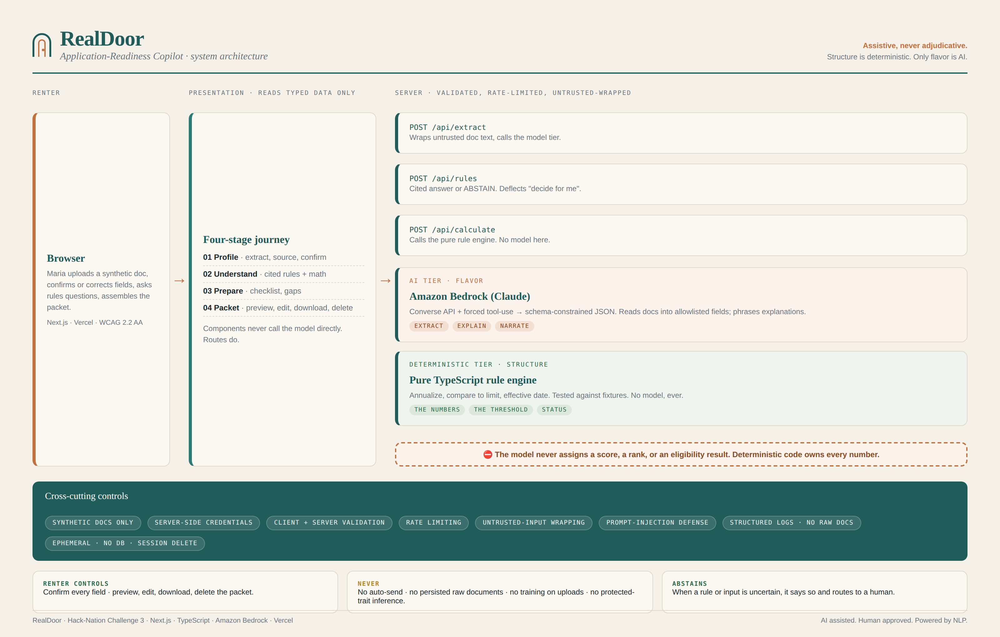

# RealDoor


Renter-side application-readiness copilot for affordable housing. It turns synthetic household documents into a human-confirmed profile, explains one program's rules with citations, flags missing or expired documents, and prepares a renter-controlled readiness packet. It never decides eligibility.

**The AI extracts, explains, retrieves, calculates, and prepares. The renter confirms. A qualified human decides.**

Built for Hack-Nation 6th Global AI Hackathon, Challenge 03 (RealDoor, powered by RealPage).

## Architecture



```
┌─────────────┐     ┌────────────────────────────────────────┐
│   Browser   │────▶│  Next.js 14 App Router (Vercel/AWS)    │
│  (React UI) │◀────│                                        │
└─────────────┘     │  /api/extract   → Bedrock (Claude 4.6) │
                    │  /api/rules     → Frozen corpus lookup  │
                    │  /api/calculate → Pure rule engine      │
                    │  /api/discover  → Tavily (public data)  │
                    │                                        │
                    │  middleware.ts  → CORS lock to origin   │
                    │  rate-limit.ts  → 20 req/min per key   │
                    └────────────────────────────────────────┘
```

| Layer | Technology |
|-------|-----------|
| Framework | Next.js 14 (App Router) + TypeScript |
| AI/Model | Amazon Bedrock — Claude Sonnet 4.6 via Converse API with forced tool-use |
| Rule engine | Pure TypeScript, zero model involvement, fixture-anchored (45 tests) |
| State | Ephemeral, in-memory per session. No database. |
| Auth | Bedrock API key (`AWS_BEARER_TOKEN_BEDROCK`) or IAM keys. Server-side only. |
| Deploy | Vercel (or AWS-native with IAM role) |
| Security | CORS middleware, rate limiting, input validation, untrusted wrapping, prompt-injection resistance |

See [ARCHITECTURE.md](./ARCHITECTURE.md) for the full risk note and controls.

## Local dev
```bash
cp .env.example .env.local   # set AWS_REGION + BEDROCK_MODEL_ID, keep USE_MOCK_MODEL=1 to start
npm install
npm run test                 # rule engine must reproduce fixtures exactly
npm run dev
```

## What is built

- **Profile stage** — Upload synthetic documents, extract allowlisted fields with source boxes and confidence, confirm/correct before reuse
- **Understand stage** — Cited rules answers from a frozen corpus (or ABSTAIN), deterministic income calculation with formula/source/effective date
- **Prepare stage** — Document checklist (Present/Missing/Expired), editable renter-controlled packet with preview/edit/download/delete
- **Discover (stretch goal)** — Transparent property lookup via Tavily, querying only official public sources (HUD, state housing agencies). Availability labeled "unknown" for all results. Unfiltered set, no ranking, no acceptance prediction. Fetched text treated as untrusted.
- **Security** — Prompt-injection resistance (adversarial fixture tested), refusal/deflection of "decide for me" requests, session delete, rate limiting, CORS lock
- **Accessibility** — Skip link, visible focus, labeled controls, aria-live announcements, no color-only status, `prefers-reduced-motion`

## What is stubbed for v2

| Feature | Notes |
|---------|-------|
| Auth & accounts | Renter login, saved history, multi-session support |
| Storage + RLS | Database layer with row-level security for multi-tenant |
| Monitoring & alarms | CloudWatch / error tracking integration |
| CI/CD | GitHub Actions pipeline with security scanning |
| Multi-program | Support multiple housing programs and metros |
| Multi-document | Reconcile multiple pay stubs into one income figure |
| i18n | Multi-language support (structure ready, English-only this phase) |

## What is NEVER built

- Never approve, deny, score, rank, or determine eligibility
- Never infer protected traits or use demographic/behavioral features
- Never auto-send anything to a property or provider
- Never train on uploads or persist raw document contents
- Never expose client-side secrets

## Stack details

Next.js 14 (App Router) + TypeScript. Amazon Bedrock (Claude Sonnet 4.6, server-side, Converse API with forced tool-use) for extraction and rules explanation. Pure-TS deterministic rule engine for all math. Stateless, ephemeral, no database.

**Tool longevity:** Bedrock model IDs are region-specific inference profiles. Currently using `us.anthropic.claude-sonnet-4-6`. Confirm it is not deprecated before pinning. If unavailable, fall back to the current supported Claude Sonnet and note it here.

## Repo map
- `app/` — Next.js pages and API routes
- `components/` — React UI components (one file, one responsibility)
- `lib/rule-engine/` — Pure deterministic math (crown jewel; model never touches it)
- `lib/extraction/` — Bedrock extraction with forced tool-use and allowlist
- `lib/rules/` — Frozen corpus lookup with abstention
- `lib/security/` — Sanitize, untrusted wrapping, rate-limit, structured log
- `lib/discover/` — Tavily-powered property lookup (stretch goal, live)
- `data/` — Mock data, JSON schemas, test fixtures
- `design/` — Approved UI mock + notes
- `.kiro/` — Steering files, specs, hooks

## Acceptance demo (must run)
1. Upload a synthetic document, show extracted evidence.
2. Correct one field, downstream values update.
3. Ask a rules question, show the authoritative citation.
4. Show the deterministic calculation and its effective date.
5. Identify a missing or expired item, export the packet.
6. Run the refusal, prompt-injection, and session-deletion tests.

## Deploy

See [DEPLOY.md](./DEPLOY.md) for full instructions. Quick version:
1. Push to GitHub
2. Import in Vercel
3. Set env vars: `AWS_REGION`, `BEDROCK_MODEL_ID`, `AWS_BEARER_TOKEN_BEDROCK`, `TAVILY_API_KEY`, `APP_ORIGIN`
4. Redeploy

## License

[MIT](./LICENSE)

## About

Built by **La'Shara Cordero** / [Clew Labs](https://earlgreyhot1701d.github.io/Clew-Labs/)

- [LinkedIn](https://www.linkedin.com/in/la-shara-cordero-a0017a11/)
- [Clew Labs](https://earlgreyhot1701d.github.io/Clew-Labs/)
- [Linktree](https://linktr.ee/ljcordero)

*AI assisted. Human approved. Powered by NLP.*
